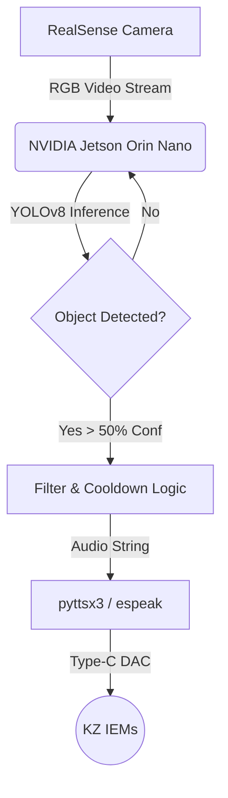

# 👓 CareLens: Real-Time Obstacle Detection

[](https://github.com/ultralytics/ultralytics)
[](https://developer.nvidia.com/embedded/jetson-orin-nano)
[](https://www.python.org/)
[](https://opensource.org/licenses/MIT)

**CareLens** is an edge-AI powered smart glasses prototype designed to assist visually impaired individuals. It uses a RealSense depth camera and a highly optimized YOLOv8 model running natively on an NVIDIA Jetson Orin Nano to provide real-time audio warnings about indoor obstacles.

---

## 🎥 Demo Video
> *Placeholder: Add a GIF or YouTube link here showing the glasses in action during the pitch!*

---

## 🚀 Key Features
- **Real-Time Inference:** Runs natively on the Jetson Orin Nano at high frame rates.
- **Expert COCO Knowledge:** Effortlessly detects critical indoor obstacles (people, chairs, tables, doors) using pre-trained YOLOv8 architecture.
- **Private Audio Cues:** Uses a dedicated Type-C DAC and in-ear monitors (KZ IEMs) to deliver offline text-to-speech warnings without internet latency.
- **Intelligent Cooldowns:** Audio engine restricts rapid-fire spam (e.g., repeating "Chair ahead" constantly) for a smooth user experience.

---

## 🧠 System Architecture



---

## 🛠️ Hardware Requirements
*   **NVIDIA Jetson Orin Nano Developer Kit** (8GB)
*   **Intel RealSense Depth Camera**
*   **Wired Earbuds / IEMs** (e.g., KZ EDX Pro with Type-C DAC) for zero-latency audio

## 💻 Software Installation

1. **Clone the Repository**
   ```bash
   git clone https://github.com/vinayakec69/Real-Time-Obstacle-Detection.git
   cd Real-Time-Obstacle-Detection
   ```

2. **Install Dependencies**
   Install the Python packages and the Linux offline audio engine:
   ```bash
   pip3 install -r requirements.txt
   sudo apt-get install -y espeak
   ```

## 🏃‍♂️ Usage

1. Connect your RealSense camera and Type-C headphones to the Jetson.
2. Run the detection script:
   ```bash
   python3 src/detect.py
   ```
3. The AI will instantly begin analyzing the camera feed and whispering obstacle warnings into your ear! Press `Q` on the video window to quit.

---

## 🤝 Contributing
Contributions, issues, and feature requests are welcome! 

## 📝 License
Distributed under the MIT License. See `LICENSE` for more information.
